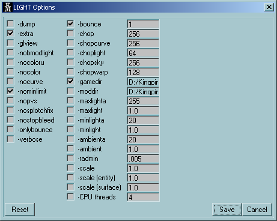

# kingpin-mapper
- fully customizable compile GUI for quake based bsp compilers (kingpin, quake, quake 2 etc...)

- upto 4 different compile tool supported. usually kpbsp.exe, kpvis.exe and kprad.exe. the 4th tool is usualy a pre-compile tool like image2wal.exe
- can be fully customized to show any compile switch available in the tool used.
- supports adding custom switched to lunch game.
- play maps directly from the GUI or once map has finished compiling. 
- dos compile commands can be viewed and saved for later use.

- Tool can also be used for running other DOS tools that are not game related, you just need to make a custom `KingpinMapper_default.txt` file to suit.

